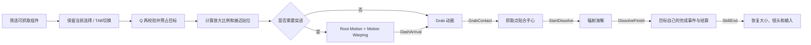

# 红莲 Q：通用抓取技能说明

更新：2026-09-18。本文替代原来只支持测试小白人的 Q 说明。

## 操作和测试入口

打开 `/Game/MineLearning/Maps/L_Guren_Retarget_Test`，Play：

- **Q**：对当前实色爪子图标对应的目标释放抓取。
- **TAB**：按稳定顺序循环选择范围内可抓取目标；不会因为距离的小幅变化自动抢回选择。
- 原图实色、不透明图标表示选中，28% 透明度表示其他候选。离开范围、被遮挡、被占用、停用或销毁的目标会移出列表。空中和技能执行期间隐藏候选图标。
- 原有移动、飞行和普通攻击保持原输入；执行 Q 时不接受重复 Q 或 TAB 切换。

出生点周围的 `Q Skill Targets/Component Targets` 文件夹包含 OreBuddy、Gunner、普通矿石、2.2 倍大矿石、仓库与售卖机。原有三个小白人仍可测试。重新 Play 可恢复本轮已经处决的目标；测试机器人关闭了实例上的 AI 自动占有，以便固定站位比较。

## 完整流程

任何阶段取消、动画被打断、目标销毁或组件失效、角色失去控制、关卡退出、超时，都会走统一恢复路径。动画通知负责正常推进，超时只防止缺失通知或异常资源让技能永远占用控制权。

## 代码分工

| 文件 / 对象 | 职责 |
| --- | --- |
| `Interaction/GrabbableComponent` | 所有对象共享的抓取点、尺寸、可用性、预占、挂接、跟随、释放与完成事件；不依赖红莲或任何目标业务类型 |
| `Manifestation/Guren/GurenQSkillComponent` | 候选筛选、稳定选择、施法校验、阶段推进、站位和体型适配、输入占用与异常恢复 |
| `Manifestation/Guren/GurenQPresentationComponent` | 订阅阶段与接触事件，播放 Montage、残影、慢镜头、镜头与辐射表现；取消时恢复全部目标网格的原材质和显隐 |
| `UI/GrabTargetIndicatorComponent` | 本地玩家的屏幕空间 WidgetComponent 生命周期装配；只按业务候选创建和回收宿主 |
| `WBP_GrabTarget` | UMG 图标视觉树、资源、深浅颜色、事件订阅、初次同步、解绑；无 Tick、轮询 Timer 或属性绑定 |
| `AGurenCharacter` | Q 与 TAB 输入入口、角色换主时取消 |
| `MineableOre` | 订阅自身组件的完成事件，通过已有 `ApplyFatalMiningHit` 结算矿石掉落与矿区通知 |

源码路径均相对 `Source/MineLearning`。Q 不包含 OreBuddy、Gunner、矿石、仓库、售卖机或 Dummy 类型判断；新增目标不需要修改技能代码。共享协议直接由组件公开的 `CanGrab / Reserve / AttachToGrip / Release` 表达，无额外按类型分流接口。

删除了旧的 `GurenQAssetSetup` 一次性 Socket/Slot 编辑器桥接代码以及 Dummy 专用 `GrabStandPoint`。已配置的 Skeleton Socket、Montage、原动画及骨架继续直接使用，不依赖施工脚本。

## 给新对象增加抓取能力

1. 在目标 Actor Blueprint 中添加 **Grabbable Component**，命名可用 `GrabPoint`。一个 Actor 配置一个主抓取点。
2. 将该 SceneComponent 放在希望被爪子捏住的位置。角色可放在头部，矿石可放在上部，设备可放在顶部抓取部位；目标 Actor 的 Pivot 不需要改到抓取位置。当前 Stone 矿石的局部抓取点为 `(0,0,55)` cm，位于实体顶部内侧；不要使用血条或图标的高度作为抓取点。
3. 根组件设置为 **Movable**。挂接与运行时位移需要可移动的场景组件。
4. 配置 `Grip Diameter`，单位是该组件局部厘米，运行时乘实际世界缩放。它表示爪子实际握住的部位直径，并非一定等于整个对象宽度。0 使用游戏中可见、非编辑器专用且具有实体包围盒的网格，取合并世界包围盒 X/Y 中较小的尺寸。隐藏网格、相机预览辅助物和零尺寸屏幕组件不参与。
5. `Grabbable` 控制是否参与选择；`Completion` 默认 `Destroy`，需要保留目标时设为 `Restore`。
6. 需要目标专属业务结算时，目标自己监听 `OnGrabCompleted(InstigatorActor)`。需要暂停自有计时器或交互会话时监听 `OnGrabStateChanged`。不要往 Q 里增加目标类型分支。
7. 编译、保存，在关卡里验证近抓、远抓、不同朝向、取消与完成。

组件会预占目标，防止另一个抓取者同时占用；暂停目标 Actor/组件 Tick 和正在运行的 AI Brain；记录并停用物理模拟。挂接期间关闭 Actor 碰撞，保持目标世界方向与原始比例。取消时恢复原位置、方向、比例、碰撞、Tick、物理速度、绝对变换标志和由本次抓取暂停的 AI。

带自定义异步任务、Timer 或外部管理器的对象，仍应在目标自己的状态事件里暂停相应业务；关闭 Tick 不能替代目标业务的异步取消协议。

完成事件先回到原始目标位置，便于矿石掉落留在矿区；然后执行目标结算和默认完成策略。`Restore` 可用于反复调试；矿石的完成事件会按既有采矿业务耗尽矿石，因此调试矿石时请用 Cancel。

## QSkill 配置

入口：`BP_GurenRetargetTest` → 继承的 `QSkill` 组件。

| 参数 | 默认值 | 作用 |
| --- | ---: | --- |
| Selection Range | 2000 cm | 角色中心到抓取点的三维范围 |
| Selection Interval | 0.1 s | 玩法候选刷新周期；仅变化时广播，UI 不轮询 |
| Require Line Of Sight | true | Visibility 射线阻挡的目标不参与选择 |
| Direct Grab Range | 200 cm | 到计算站位的水平距离，小于该值直接 Grab |
| Grip Socket | `Q_GrabHead` | 红莲右爪抓取挂点 |
| Contact Offset | `(165,53,67.54)` cm | GrabContact 时相对正常站立胶囊中心的手心位置；来自当前 UE 动画姿势 |
| Claw Diameter | 110 cm | 正常比例的爪子握持直径 |
| Maximum Scale | 12 | 最大支持的放大倍率；超限对象不显示可抓取提示 |
| Execution Timeout | 8 s | 异常超时取消；若延长动画，应同步调整 |
| Arrival Tolerance | 55 cm | 突进后的水平站位误差上限 |
| Contact Tolerance | 150 cm | 接触时的水平误差上限，随执行比例缩放 |
| Reach Speed | 25 | 近抓站位的插值速率 |

放大倍率取以下三项最大值：`1`、`目标握持直径 / 正常爪径`、`目标抓取点距脚底高度 / 正常接触点距脚底高度`。角色视觉网格围绕脚底放大，胶囊和常规移动参数保持原值，避免临时放大挤开场景碰撞体。完成和取消恢复精确的原网格相对变换，目标本身不跟随红莲变大。

接近方向由“红莲到目标”计算，`Contact Offset` 随接近方向旋转，因此前后左右接近都使用同一规则。低矮对象在接触时提到同一爪子姿势，不修改既有骨架或动画。抓取点与 Actor Pivot 不重合时，组件在手部姿势更新后重新计算目标平移，避免手掌旋转造成抓取点偏离手心。

当前是项目既有的单机玩法。组件拒绝非 Authority 的预占；未添加联机 RPC、复制或客户端预测，不应把本实现当作已经完成的多人技能。

## UMG 指示器配置

- Widget：`/Game/MineLearning/UI/Guren/WBP_GrabTarget`。
- 纹理：`/Game/MineLearning/UI/Guren/T_GurenGrabClaw`。
- 源图：`ArtSource/UI/Guren/T_GurenGrabClaw.png`。由既有 UE 抓头姿势图标通过内置 imagegen 编辑：放大圆形掌心和红核、缩短五指、保留银色指节与金色爪尖。源图带透明背景；只改变 HUD 图形，不修改角色真实手掌、骨架或动画。
- `SelectedTint = (1,1,1,1)`：中性白乘色，完整显示原图的金属深浅与红色掌心，不再乘深红色压黑。`CandidateTint = (1,1,1,0.28)`：同图仅降低透明度。
- `BP_GurenRetargetTest → GrabIndicators`：替换 `Indicator Class`、调整 `Draw Size`（72×72）。
- `Grabbable → Indicator Height`：图标在目标可见网格顶部之上的偏移，默认 45 cm。

Widget Construct 先解绑旧绑定、再绑定 `OnTargetsChanged`、执行一次 `RefreshAppearance`；Destruct 解绑。同一张可替换 Brush 通过颜色表示选择，Widget 与 Image 均不参与 Hit Test，不抢焦点、不修改输入模式。屏幕投影由 UE 的 Screen Space WidgetComponent 执行，UMG 蓝图不使用 Tick。

## 动画与表现配置

入口：`/Game/MineLearning/Characters/Guren/Blueprints/BPC_GurenQPresentation`。挂在 `BP_GurenRetargetTest → QPresentation` 上；实例覆写优先于类默认值。

| 配置 | 默认值 / 资源 |
| --- | --- |
| Dash Montage | `Animations/Q/AM_Q_Dash` |
| Grab Montage | `Animations/Q/AM_Q_GrabDissolve` |
| Afterimage Material | `VFX/M_QDashAfterimage` |
| Dash Base Duration / Travel Speed | 0.48 s / 3500 cm/s |
| Dash Duration Range | 0.57–1.05 s |
| Afterimage Delay / Interval / Lifetime | 0.12 / 0.065 / 0.24 s |
| Afterimage Opacity / Minimum Speed / Maximum Afterimages | 0.24 / 300 cm/s / 4 |
| Contact Time Scale / Slow Motion Duration | 0.25 / 0.22 真实秒 |
| Impact Strength / Dissolve Shake Duration | 1 / 0.35 真实秒 |
| Close Up FOV | 10° |
| Use Execution Camera | true |
| Execution Camera Distance / Height | 750 / 60 cm，按执行倍率适配 |
| Execution Camera Yaw Offset / Pitch | -20° / -10° |
| Execution Camera Blend In / Out | 0.7 / 0.45 真实秒 |

大目标在放大时就启动镜头调整，接触后转入正面提起构图。普通目标在 GrabContact 启动正面镜头。镜头保存并恢复原控制旋转、SpringArm 臂长和 TargetOffset；慢镜头保存并恢复原全局时间倍率。插值使用真实时间，避免慢镜头拖长恢复。SpringArm 继续保留原碰撞检测。

Montage 通知类为 `Guren Q Event`，Event 名称区分如下：

| Montage | 通知 / 窗口 | 时间 |
| --- | --- | ---: |
| Dash | Motion Warping，`Q_DashTarget`，忽略 Z | 0.1333–0.55 s |
| Dash | `DashArrival` | 0.55 s |
| Grab | `GrabContact` | 0.20 s |
| Grab | `StartDissolve` | 1.0667 s |
| Grab | `DissolveFinish` | 3.9333 s |
| Grab | `SkillEnd` | 4.0333 s |

Root Motion From Montages Only、QFullBody Slot 和生产 Socket 保持原配置。DashArrival 延后一帧校验，以等待当前帧 CharacterMovement 应用 Root Motion，重复通知不会积累额外回调。

辐射效果继续复用 `/Game/MineLearning/VFX/RadiantDissolve/BP_RadiantDissolve_Test`。Q 的 `RadiationChanged` 蓝图在调用 Dissolve 前使用 `GetRadiationDuration()`，从 Grab Montage 的 StartDissolve/DissolveFinish 通知时间计算时长，不再重复硬编码 2.866667 秒。调效果参数见 [辐射溶解说明](VFX/RadiantDissolve_FinalScatter.md)。

震屏只在 StartDissolve 发生。接触仅慢镜头，结束不额外震屏。取消时先清理效果，再恢复各 MeshComponent 进入辐射前的原材质与显隐，最后释放目标。

## 掌心辐射波动 V3（2026-09-18）

### 设计与资源

参考用户提供的《Guren_RadiantWave_VFX_V3_Construction》，视觉中心为右掌辐射器和接触区域。小型白热核、深红至品红的薄破碎波、短分叉弧、少量细粒和透明热折射共同表达升温，不使用原版大圆环与规则 Z 形闪电。造型参考 [官方红莲商品图](https://tamashiiweb.com/item/14024/)，折射实现核对 [UE Refraction 文档](https://dev.epicgames.com/documentation/en-us/unreal-engine/using-refraction-in-unreal-engine)。这是针对本项目抓取镜头的风格化改编。

下列正式资源位于 `/Game/MineLearning/Characters/Guren/VFX/`，直接编辑 UE 资产即可维护，运行时不依赖制作脚本：

| 资源 | 用途 |
| --- | --- |
| `NS_GurenPalmRadiation` | 六层局部空间 CPU Niagara，共用掌心挂点 |
| `M_GurenPalmWave` | Additive / Unlit 分层材质；UV 距离场、粒子随机数、年龄和统一强度驱动 |
| `MI_GurenPalmRadiation` | `Layer = 0`，薄破碎扩散波 |
| `MI_GurenPalmArc` | `Layer = 1`，不等长、粗细渐变的短分叉弧 |
| `MI_GurenPalmCore` | `Layer = 2`，白热核及红色柔光边缘 |
| `MI_GurenPalmMicroArc` | `Layer = 3`，较细的短暂微弧 |
| `MI_GurenPalmSpark` | `Layer = 4`，少量热粒 |
| `M_GurenPalmHeatDistortion` | Translucent / Unlit 的折射 Sprite，双层异向流动扰动、柔边与 Depth Fade |

五个发光材质实例直接继承同一个主材质。`Layer` 决定层的形状，不是整体强度。旧 `ArcMode / PulseHz / PulseDepth / ArcJitterHz` 材质控制已移除；统一呼吸现在属于表现组件。旧的 `PalmSparks / RadiationWaves / ShortArcs` 三个发射器已从当前系统删除。

### 六层粒子与缩放

尺寸为角色 Mesh 比例为 1 时的厘米，最终可见轮廓还会受到材质透明遮罩裁剪。全部遵守正常深度遮挡。

| Emitter | 发射 | 寿命 | Sprite 宽高 | 表现 |
| --- | --- | --- | --- | --- |
| `CorePulse` | 接触后单次 1 个 | 由 Q 销毁；Niagara 上限 100 s | 76–84 | 持续核心；无粒子轮换呼吸，避免额外快闪 |
| `WaveRing` | 3.2/s | 0.32–0.46 s | 112–124 | 随掌心法线朝向的薄破碎波，不朝镜头摆正 |
| `Arc_Main` | 7/s | 0.13–0.23 s | 112–124 | 掌面附近三条不规则短弧，每条多段、末端收细，带少量分支 |
| `Arc_Micro` | 12/s | 0.06–0.13 s | 66–76 | 较小的微弧，补充斜视角的放电可见度 |
| `HeatDistortion` | 5/s | 0.30–0.40 s | 116–130 | 覆盖掌心和紧邻接触区的透明空气扭曲，无烟雾贴图 |
| `HotSparks` | 14/s | 0.16–0.32 s | 1.2–2.5 | 半径 20 cm 内少量热粒，沿掌前方向散出，速度 42 cm/s |

`WaveRing / Arc_Main` 使用 Custom Facing / Custom Alignment，局部法线 `(0,-1,0)`，局部上轴 `(0,0,1)`；姿态随 `socket_palm_fx` 运动。微弧、核心柔光和热折射使用 Billboard，保留多视角可见度。电弧为材质距离场 Sprite，不是跨物体连接的 Beam，也不伪称真实电路模拟。

六个 Emitter 的 Particle Update 均应用 `Apply Owner Scale to Attributes`，仅缩放 **Initial Sprite Size**，Owner Scale 绑定 `Engine.Owner.Scale`。局部空间已经缩放位置、轨迹，不能再次缩放位置或速度；`HotSparks` 的 Shape Location 也关闭重复 Owner Scale。缩放模块位于 Solve Forces and Velocity 之前，满足 Niagara 的模块依赖。每帧从初始尺寸计算当前尺寸，支持 1 → 3 → 0.5 → 1 连续变化，避免逐帧累乘。

### 集中配置

入口：`BPC_GurenQPresentation → Q Effects / Palm Radiation`；角色组件的实例覆写优先。

| 参数 | 默认配置 | 用途 |
| --- | --- | --- |
| Palm Radiation System | `NS_GurenPalmRadiation` | 替换整套输出效果 |
| Palm Radiation Socket | `socket_palm_fx` | 现有 palm_r 子骨骼，不修改骨架 |
| Palm Radiation Offset | 位置 `(0,-7,3)`，旋转 0，比例 1 | 将特效中心放到真实辐射器表面前约 1 cm |
| Radiation Intensity | 内置可编辑曲线 | 横轴为 GrabContact → DissolveFinish 的归一化动画进度，纵轴 0–1 |
| Radiation Pulse Frequency | 0.7 Hz | 慢呼吸频率，0 为停止呼吸 |
| Radiation Pulse Depth | 0.15 | 呼吸幅度，0 为恒定曲线输出 |
| Radiant Material Slot | `M_Guren_RadiantCore` | 只控制真正的掌心辐射器材质槽 |
| Radiation Light Intensity | 70 lm | 单个红色无阴影局部 Point Light；0 可关闭 |
| Radiation Light Radius | 90 cm | 正常体型局部照明范围，随掌心比例变化 |
| Radiation Heat Tail | 0.15 s | 正常释放后的短暂透明余热，不保留电弧与补光 |

强度曲线默认关键点为 `(0,0.18)、(0.18,0.45)、(0.65,0.72)、(0.9,1)、(1,0.8)`。`UpdatePalmRadiation()` 读取真实 Grab Montage 位置及通知时间，不另存重复的技能时长。慢镜头和动画变速自然改变整个升温节奏。

Niagara 外部参数只有两个：`User.Intensity` 驱动五层发光；`User.HeatIntensity` 在输出期间跟随相同强度，释放时单独快速衰减。Particle Update 写入 `Particles.DynamicMaterialParameter.xy`，材质通过 Dynamic Parameter 的 Param1/Param2 读取。修改材质时必须检查 **Layer** 连接；不能把旧频率参数误接到层选择器。

掌心材质修改位于 `/Game/MineLearning/Characters/Guren/Materials/M_Guren_Surface`：新增 `RadiantIntensity`，默认 0 时保留原 `Emission`。每次抓取只为指定的辐射器槽创建 MID，参数随粒子强度更新；其余角色材质槽不受影响。结束恢复原材质对象，不向共享材质实例写运行时值。

### 流程与代码职责

1. `GurenQSkillComponent` 通过既有 OnGrabContact / OnStageChanged 提供权威事件，继续只负责玩法。
2. `GurenQPresentationComponent::StartPalmRadiation()` 创建唯一附着 Niagara、辐射器 MID 和一个局部灯光。重复接触不会叠加；缺失系统、挂点或 Dedicated Server 会跳过此项表现。
3. 表现组件已有的活动 Tick 计算动画归一化强度，同步 Niagara、模型发光和灯光。灯光半径乘当前掌心比例，光通量乘比例平方，避免巨大化后照明变弱。
4. StartDissolve 仍触发 `RadiationChanged` 蓝图。共享溶解控制器从接触点展开红热，后段局部白热并散解；其 Origin 随目标移动，详见下文链接。
5. Release 将发光强度降为 0，仅保留最多 0.15 s 的折射余热，随后 `StopPalmRadiation()` 销毁组件和灯光并恢复原掌心材质。辐射中取消、EndPlay 立即清理；新一轮接触会先清除上一轮尚存的余热。

目标原材质与显隐仍由表现组件的快照和共享控制器成对恢复。目标搜索、统一可抓取接口、伤害、动画、翼部及镜头规则没有增加特效特例。

目标溶解使用 `MF_RadiantDissolve` / `MF_RadiantSurface` 和原材质的临时 MID，保留原始着色器，不再按名称切换通用替代材质。共享配置、材质接入方法与材质丢失修复见 [辐射溶解说明](VFX/RadiantDissolve_FinalScatter.md)。

### 图标生成记录

执行模式：内置 imagegen；编辑参考为上一版正式爪子源图。提示要点：same Guren radiation claw, transparent background; greatly enlarge round palm and red core; shorten all five fingers to about 45%; palm roughly 55% of icon width; compact silver segmented fingers and gold tips; full original color; readable at 64px; no wrist, scene, badge, particles or halo。生成结果替换同一正式 PNG，不保留阶段图或额外版本。

## 验证与维护

### V3 首轮验证（2026-09-18）

- UE 5.8 Win64 Development Editor 编译、链接成功。
- `MineLearning.GurenQ.GrabbableLifecycle` 验证通用目标生命周期；`MineLearning.GurenQ.PalmRadiationLifecycle` 验证掌心挂点、唯一实例、MID 恢复、灯光缩放、正常释放余热、取消、缺失挂点和组件销毁。
- 尺寸回归读取六个 Emitter 编译后模拟数据集的实际 `SpriteSize`，在 1 → 3 → 0.5 → 1 倍 Mesh 比例下检查宽高；同时检查 Dynamic Material Parameter 的强度值，避免只验证组件变换却没有验证实际粒子。
- 最终三个 Niagara 系统的编译状态为 UpToDate，编译错误/警告和 Niagara 栈错误/警告均为 0。栈中的版本升级说明与模块使用说明属于 Info。
- 实际 PIE 包含 Gunner 正面、侧面、斜面、OreBuddy、大矿石、仓库、关闭 Bloom 和辐射中取消。正常执行经过 Dash → Grab → Radiation → Release → Idle；掌心系统和局部灯光峰值各 1，结束后归零，Mesh 比例恢复。
- 冻结同一动画帧进行折射开/关对比；热折射集中在掌心附近，有纹理或轮廓的背景更容易辨认。关闭 Bloom 后仍能辨认局部红热和短弧。
- Gunner 的两个既有 HUD（`WBP_GunnerAmmo`、`WBP_CompanionBark`）在 Destruct 时增加 `Is Valid(ObservedGunner)` 保护，再执行原有成对解绑；保留原回调和事件驱动方式，不引入 UI Tick。

最终八组 PIE 没有 Blueprint Runtime Error。检查过程中一次编辑器 Niagara 状态查询超时；独立重跑自动化与实际播放后正常完成。测试画面出现显存预算告警，当前机器同时存在其他 UE 进程；本轮没有将帧率作为性能验收结论，也没有修改全局显存预算或其他项目。

画面遵守深度遮挡：目标挡住掌心时不会把白热核心强制画在目标前面；此时主要通过指缝短弧、局部补光与目标红热传达接触输出。远距离或平坦天空背景下的热折射较弱，不能用加大整屏扭曲掩盖这一点。

### 材质保真回归

新增 `MineLearning.GurenQ.MaterialPreservation`，用于发现“生命周期正常但抓取时原色/纹理丢失”的问题。原材质通过 `MF_RadiantSurface` 接入红热和裁切，Static/Skeletal 都调用 `MaterialEffectLibrary::CreateIsolatedMaterialInstance`；临时实例复制有效参数，原 MID 保持独立，取消后恢复同一个原材质对象。

2026-09-18 修复后重新编译通过，三项 `MineLearning.GurenQ` 自动化测试全部通过。实际 PIE 覆盖 OreBuddy、矿石、大矿石、仓库、售卖机、Gunner 的辐射中取消，以及同一 OreBuddy 再次完整执行（Restore 策略）。七组共 55 次材质槽检查均保留原着色器和已有参数，结束恢复原材质对象，原 MID 不受污染，无残留掌心实例或 Blueprint Runtime Error。固定同一姿势进行原材质/零进度临时材质对照，并检查原配色、纹理及末段散解。控制器 Reset 恢复后不再 ApplyFrame；预览也先准备独立实例。

### 高亮与裁切回归

2026-09-18 高亮与裁切补验：Quinn 主材质和矿石阶段材质已接入共享函数；修正根输入 UseConstant 覆盖连接及旧不透明优化状态。原颜色/发光常量作为共享函数输入保留，不关闭 Nanite，不增加目标类型判断。新增 `MineLearning.GurenQ.RadiantSurfaceCoverage`，当前四项自动化测试全部通过。小白人、矿石、大矿石、OreBuddy、仓库、售卖机、Gunner 均检查实际表面升温、部分分解、末段消失及取消恢复；小白人和两种尺寸矿石另外完成未暂停的完整 Q 播放。详细像素对照和验证边界见 [高亮与裁切补验](VFX/RadiantDissolve_FinalScatter.md#高亮与裁切补验2026-09-18)。

### 既有通用抓取回归范围

通用抓取版本已测试六类对象的真实 Montage 通知流程、抓取点跟随、红莲巨大化与恢复；还包括重复预占、第二抓取者竞争、Restore/Destroy 完成策略、缺失挂点、目标中途销毁、Montage 打断和超时。前一版图标已验证当前目标 Alpha 为 1，其余为 0.28。本次 V3 未重新设计图标或更改目标接口。

调试顺序：先确认候选和可抓取组件，再看抓取点、Mobility、视线、范围和尺寸上限，最后检查 Montage、Socket、通知以及 Niagara 的编译和栈状态。不要用增大抓取容差或关闭深度遮挡掩盖定位错误。

旧版本的三个 Emitter、PulseHz/ArcJitterHz 等参数不再是当前配置。以本文“掌心辐射 V3”资源与配置表及正式 UE 资产为准。一次性制作脚本、原始 JSON、预览图片在交付后清理；保留正式资产、业务代码和自动化测试。测试地图为 `/Game/MineLearning/Maps/L_Guren_Retarget_Test`，Q 抓取，TAB 切换。
