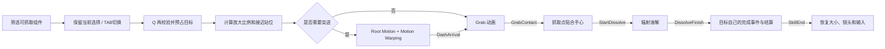

# 红莲 Q：通用抓取技能说明

## 2026-09-25 Q5：两段重新生成及 UE 对照

当前 Blender 审阅源为 `ArtSource/Characters/GurenSeitenHakkyoShiki/Guren_Q_V2.blend`，沿用用户批准的两文件例外。Q4 被用户否决，后文 Q4/V3/V2 均为历史研究记录。

| 入口 | 内容 |
| --- | --- |
| `Q5_Guren_Review` / `Q5_Mannequin_Review` | 连续预览，140 帧、30 FPS，含冲刺位移；循环重新开始不是无缝移动循环 |
| `Q5_Guren_Dash` / `Q5_Dash_Guren` | 独立冲刺，18 帧、0.5667 秒 |
| `Q5_Guren_GrabLift` / `Q5_GrabLift_Guren` | 独立接触、闭爪、提举、注视、释放，123 帧、4.0667 秒 |
| `AnimChar_RAW_09_GrabCoherent` | 合格抓取原始云端输出，未做本地运动修正 |
| `AnimChar_RAW_10_DashCoherent` | 合格冲刺原始云端输出，未做本地运动修正 |

UE 审阅目录 `/Game/MineLearning/Characters/Guren/Animations/Q/AnimCharReview` 保存 `AN_Q5_Dash`、`AN_Q5_GrabLift`、`AM_Q5_Dash`、`AM_Q5_GrabLift`。Montage 保留原通知与片段时长。正式 Q Sequence、Montage、蓝图默认引用未替换，正常进入项目仍使用旧 Q；验证时仅在 PIE 角色实例切换到上述审阅蒙太奇。

### 插件使用审计与本轮方法

插件运动生成接收 3D Rest、关键姿势、时间索引和语义提示；图片需先经过单张姿态识别。检查确认 30 FPS、零起始索引与包含端点的帧数传递正确。前版主要问题是稀疏姿势之间生成了周期性身体摆动，原始 Q4 就存在约 1.765 Hz 的晃动，本地版本又保留了它。单纯写“保持稳定”不足以约束输出。

本轮以真正从 UE 评估的两段原动画为语义和姿势依据，映射到 AnimChar 原生小人，校准掌面轴、稳定脚位及肘平面，拆成两次独立生成。最终冲刺用 10 个约束帧，抓取用 64 个约束帧，含加密的高举保持与回收过渡。没有新增 AI 图片或姿态识别调用，避免把已有明确的 3D 姿势再做有损识别。Codex 仍可生成姿势图片并经插件提取姿态，Q4 的高举参考图就是已实际使用的例子。

| 运动生成请求 | 任务 ID | 结果 |
| --- | --- | --- |
| 冲刺 1 | `5f6e30ba-1d8d-4510-80f5-e42b4d8ea4d2` | 姿势/推进不合格，弃用 |
| 抓取 1 | `25124368-8f69-4b71-9d2a-461f0ae572ab` | 高举仍有约 10 cm 起伏，弃用 |
| 抓取 2 | `641bd603-ef0f-4b2d-ab4a-6bafb2861eaa` | 保持稳定，但脚翻转、回收急跳，弃用 |
| 冲刺 2 | `9fcf6eda-e607-48db-86ca-db95e4b6ff7e` | 末段左臂翻转，弃用 |
| 冲刺 3 | `f3052dda-bc37-438e-bf4e-49c3041b7029` | 落脚仍有急转，弃用 |
| 抓取 3 | `b365358e-506c-4935-845a-50170368a6a2` | 原始输出通过后用于适配 |
| 冲刺 4 | `70f7fa9b-1176-45a9-a6bb-39023188fa60` | 原始输出通过后用于适配 |

合计 7 次必要运动请求，不等于 7 积分；未查询实时余额。失败输出未用于最终动作。合格原始 Action 保留，小人到红莲的适配在本地完成：固定机械骨长、脚锚点、左右掌面、金爪闭合，恢复小人骨架没有的原翼部收拢/展开和左指自然弯曲。保留已修复的左前臂绑定与金爪几何。

### 对照验收与边界

原版与新版均使用 `L_Guren_Retarget_Test` 的 Near Grab 假人、同一接近距离和镜头。临时提高处决生命阈值、关闭视线筛选以排除测试平台遮挡，未保存这些运行时设置。第一次尝试使用 `set_editor_property` 引起蓝图组件重建，恢复了旧 Montage；那组捕捉作废。之后改用运行时直接属性赋值，并在每个捕捉点核对实际 Montage 路径。

- UE 解码后，两段去根位移的右手边界差由旧版 **48.857 cm / 45.566°** 降为 **0.009 cm / 0.004°**；左手由 **127.662 cm / 47.011°** 降为 **0.054 cm / 0.045°**。这衡量边界姿势，不等于速度曲线全程无变化。
- 高举右臂约 **54.55°**，保留小幅肘屈。新版高举 49–85 帧右手范围 **0.440 cm / 0.177°**；旧版高点 70–82 帧为 **1.372 cm / 0.903°**。比较窗口长度不同，新版保持更长。原版躯干本来静止，不能宣称所有身体部位都更稳。
- 最终 PIE 慢放查看冲刺、接触、合爪、抬高、注视和释放；翼部已恢复冲刺收拢、抓取展开，左手自然弯曲，没有观察到左臂再次断开。与旧 UE 对照，当前目标和机位下两段衔接及高举抓握稳定性更好。
- 无额外慢放的实际运行记录 590 个采样，确认 `AM_Q5_Dash` / `AM_Q5_GrabLift`，完整经过 DASH → GRAB → RADIATION → RELEASE → IDLE，结束倍率为 1。约 1.04 秒高举稳定窗内右手范围 **2.71 mm / 0.139°**，抓取挂点 **3.22 mm**，胸/头约 **1.44 mm**，脚漂移不超过 **0.13 mm**；转段右手高度连续。
- Blender 红莲连续播放约 58 秒、小人约 79 秒，并查看关键帧和掌侧近景。保护检查通过：59 骨 Rest/层级逐矩阵差为 0，原生产 Action 和 7 个约束保留，4 个保护 Action 哈希相同，Q5 骨局部 Scale 为 1。约束数量检查不等价于独立逐参数历史比较。
- UE 写入后回读骨姿势，与预期最大位置差约 **1.25 mm**、角差约 **0.056°**。正式 Q 目录的既有资源未修改；新增内容仅为审阅子目录。
- 已保存并通过独立后台 Blender 只读重开核验六个场景、帧数、非空 Action Slot 和多帧骨位置。保存 SHA-256：`942fa8a5c8f3e4c96fbc91061742c26241c1a8df86503dcf55ec58ef265e42ff`；R19 仍为 `8b838431ccf91399bc751e16b030a4469b5514467b49c2dda9938322731787c3`。

结论限于本次双片段动画及上述运行时对照，不宣称已完成所有敌人体型、地形、网络或取消分支的发布回归。结束 PIE 后恢复原地图及后台 CPU 节流偏好。一次性脚本、导出数据、服务临时文件和验收截图按项目规则清理；合格原始动作直接保留在 Blender 文件内。

更新：2026-09-18。本文替代原来只支持测试小白人的 Q 说明。

## 操作和测试入口

打开 `/Game/MineLearning/Maps/L_Guren_Retarget_Test`，Play：

- **Q**：对当前实色爪子图标对应的目标释放抓取。
- **TAB**：按稳定顺序循环选择范围内可抓取目标；不会因为距离的小幅变化自动抢回选择。
- 原图实色、不透明图标表示选中，28% 透明度表示其他候选。离开范围、被遮挡、被占用、停用或销毁的目标会移出列表。空中和技能执行期间隐藏候选图标。
- 原有移动、飞行和普通攻击保持原输入；执行 Q 时不接受重复 Q 或 TAB 切换。

出生点周围的 `Q Skill Targets/Component Targets` 文件夹包含 OreBuddy、Gunner、普通矿石、2.2 倍大矿石、仓库与售卖机。原有三个小白人仍可测试。重新 Play 可恢复本轮已经处决的目标；测试机器人关闭了实例上的 AI 自动占有，以便固定站位比较。

## 完整流程


```mermaid
flowchart LR
    A[筛选可抓取组件] --> B[保留当前选择 / TAB切换]
    B --> C[Q 再校验并预占目标]
    C --> D[计算放大比例和接近站位]
    D --> E{是否需要突进}
    E -->|是| F[Root Motion + Motion Warping]
    E -->|否| G[Grab 动画]
    F -->|DashArrival| G
    G -->|GrabContact| H[抓取点贴合手心]
    H -->|StartDissolve| I[辐射溶解]
    I -->|DissolveFinish| J[目标自己的完成事件与结算]
    J -->|SkillEnd| K[恢复大小、镜头和输入]
```

任何阶段取消、动画被打断、目标销毁或组件失效、角色失去控制、关卡退出、超时，都会走统一恢复路径。动画通知负责正常推进，超时只防止缺失通知或异常资源让技能永远占用控制权。

## 代码分工

| 文件 / 对象 | 职责 |
| --- | --- |
| `Interaction/GrabbableComponent` | 所有对象共享的抓取点、尺寸、可用性、预占、挂接、跟随、释放与完成事件；不依赖红莲或任何目标业务类型 |
| `Manifestation/Guren/GurenQSkillComponent` | 候选筛选、稳定选择、施法校验、阶段推进、站位和体型适配、输入占用与异常恢复 |
| `Manifestation/Guren/GurenQPresentationComponent` | 订阅阶段与接触事件，播放 Montage、残影、慢镜头、镜头与辐射表现；取消时恢复全部目标网格的原材质和显隐 |
| `UI/GrabTargetIndicatorComponent` | 本地玩家的屏幕空间 WidgetComponent 生命周期装配；只按业务候选创建和回收宿主 |
| `WBP_GrabTarget` | UMG 图标视觉树、资源、深浅颜色、事件订阅、初次同步、解绑；无 Tick、轮询 Timer 或属性绑定 |
| `AGurenCharacter` | Q 与 TAB 输入入口、角色换主时取消 |
| `MineableOre` | 订阅自身组件的完成事件，通过已有 `ApplyFatalMiningHit` 结算矿石掉落与矿区通知 |

源码路径均相对 `Source/MineLearning`。Q 不包含 OreBuddy、Gunner、矿石、仓库、售卖机或 Dummy 类型判断；新增目标不需要修改技能代码。共享协议直接由组件公开的 `CanGrab / Reserve / AttachToGrip / Release` 表达，无额外按类型分流接口。

删除了旧的 `GurenQAssetSetup` 一次性 Socket/Slot 编辑器桥接代码以及 Dummy 专用 `GrabStandPoint`。已配置的 Skeleton Socket、Montage、原动画及骨架继续直接使用，不依赖施工脚本。

## 给新对象增加抓取能力

1. 在目标 Actor Blueprint 中添加 **Grabbable Component**，命名可用 `GrabPoint`。一个 Actor 配置一个主抓取点。
2. 将该 SceneComponent 放在希望被爪子捏住的位置。角色可放在头部，矿石可放在上部，设备可放在顶部抓取部位；目标 Actor 的 Pivot 不需要改到抓取位置。当前 Stone 矿石的局部抓取点为 `(0,0,55)` cm，位于实体顶部内侧；不要使用血条或图标的高度作为抓取点。
3. 根组件设置为 **Movable**。挂接与运行时位移需要可移动的场景组件。
4. 配置 `Grip Diameter`，单位是该组件局部厘米，运行时乘实际世界缩放。它表示爪子实际握住的部位直径，并非一定等于整个对象宽度。0 使用游戏中可见、非编辑器专用且具有实体包围盒的网格，取合并世界包围盒 X/Y 中较小的尺寸。隐藏网格、相机预览辅助物和零尺寸屏幕组件不参与。
5. `Grabbable` 控制是否参与选择；`Completion` 默认 `Destroy`，需要保留目标时设为 `Restore`。
6. 需要目标专属业务结算时，目标自己监听 `OnGrabCompleted(InstigatorActor)`。需要暂停自有计时器或交互会话时监听 `OnGrabStateChanged`。不要往 Q 里增加目标类型分支。
7. 编译、保存，在关卡里验证近抓、远抓、不同朝向、取消与完成。

组件会预占目标，防止另一个抓取者同时占用；暂停目标 Actor/组件 Tick 和正在运行的 AI Brain；记录并停用物理模拟。挂接期间关闭 Actor 碰撞，保持目标世界方向与原始比例。取消时恢复原位置、方向、比例、碰撞、Tick、物理速度、绝对变换标志和由本次抓取暂停的 AI。

带自定义异步任务、Timer 或外部管理器的对象，仍应在目标自己的状态事件里暂停相应业务；关闭 Tick 不能替代目标业务的异步取消协议。

完成事件先回到原始目标位置，便于矿石掉落留在矿区；然后执行目标结算和默认完成策略。`Restore` 可用于反复调试；矿石的完成事件会按既有采矿业务耗尽矿石，因此调试矿石时请用 Cancel。

## QSkill 配置

入口：`BP_GurenRetargetTest` → 继承的 `QSkill` 组件。

| 参数 | 默认值 | 作用 |
| --- | ---: | --- |
| Selection Range | 2000 cm | 角色中心到抓取点的三维范围 |
| Selection Interval | 0.1 s | 玩法候选刷新周期；仅变化时广播，UI 不轮询 |
| Require Line Of Sight | true | Visibility 射线阻挡的目标不参与选择 |
| Direct Grab Range | 200 cm | 到计算站位的水平距离，小于该值直接 Grab |
| Grip Socket | `Q_GrabHead` | 红莲右爪抓取挂点 |
| Contact Offset | `(165,53,67.54)` cm | GrabContact 时相对正常站立胶囊中心的手心位置；来自当前 UE 动画姿势 |
| Claw Diameter | 110 cm | 正常比例的爪子握持直径 |
| Maximum Scale | 12 | 最大支持的放大倍率；超限对象不显示可抓取提示 |
| Execution Timeout | 8 s | 异常超时取消；若延长动画，应同步调整 |
| Arrival Tolerance | 55 cm | 突进后的水平站位误差上限 |
| Contact Tolerance | 150 cm | 接触时的水平误差上限，随执行比例缩放 |
| Reach Speed | 25 | 近抓站位的插值速率 |

放大倍率取以下三项最大值：`1`、`目标握持直径 / 正常爪径`、`目标抓取点距脚底高度 / 正常接触点距脚底高度`。角色视觉网格围绕脚底放大，胶囊和常规移动参数保持原值，避免临时放大挤开场景碰撞体。完成和取消恢复精确的原网格相对变换，目标本身不跟随红莲变大。

接近方向由“红莲到目标”计算，`Contact Offset` 随接近方向旋转，因此前后左右接近都使用同一规则。低矮对象在接触时提到同一爪子姿势，不修改既有骨架或动画。抓取点与 Actor Pivot 不重合时，组件在手部姿势更新后重新计算目标平移，避免手掌旋转造成抓取点偏离手心。

当前是项目既有的单机玩法。组件拒绝非 Authority 的预占；未添加联机 RPC、复制或客户端预测，不应把本实现当作已经完成的多人技能。

## UMG 指示器配置

- Widget：`/Game/MineLearning/UI/Guren/WBP_GrabTarget`。
- 纹理：`/Game/MineLearning/UI/Guren/T_GurenGrabClaw`。
- 源图：`ArtSource/UI/Guren/T_GurenGrabClaw.png`。由既有 UE 抓头姿势图标通过内置 imagegen 编辑：放大圆形掌心和红核、缩短五指、保留银色指节与金色爪尖。源图带透明背景；只改变 HUD 图形，不修改角色真实手掌、骨架或动画。
- `SelectedTint = (1,1,1,1)`：中性白乘色，完整显示原图的金属深浅与红色掌心，不再乘深红色压黑。`CandidateTint = (1,1,1,0.28)`：同图仅降低透明度。
- `BP_GurenRetargetTest → GrabIndicators`：替换 `Indicator Class`、调整 `Draw Size`（72×72）。
- `Grabbable → Indicator Height`：图标在目标可见网格顶部之上的偏移，默认 45 cm。

Widget Construct 先解绑旧绑定、再绑定 `OnTargetsChanged`、执行一次 `RefreshAppearance`；Destruct 解绑。同一张可替换 Brush 通过颜色表示选择，Widget 与 Image 均不参与 Hit Test，不抢焦点、不修改输入模式。屏幕投影由 UE 的 Screen Space WidgetComponent 执行，UMG 蓝图不使用 Tick。

## 动画与表现配置

入口：`/Game/MineLearning/Characters/Guren/Blueprints/BPC_GurenQPresentation`。挂在 `BP_GurenRetargetTest → QPresentation` 上；实例覆写优先于类默认值。

| 配置 | 默认值 / 资源 |
| --- | --- |
| Dash Montage | `Animations/Q/AM_Q_Dash` |
| Grab Montage | `Animations/Q/AM_Q_GrabDissolve` |
| Afterimage Material | `VFX/M_QDashAfterimage` |
| Dash Base Duration / Travel Speed | 0.48 s / 3500 cm/s |
| Dash Duration Range | 0.57–1.05 s |
| Afterimage Delay / Interval / Lifetime | 0.12 / 0.065 / 0.24 s |
| Afterimage Opacity / Minimum Speed / Maximum Afterimages | 0.24 / 300 cm/s / 4 |
| Contact Time Scale / Slow Motion Duration | 0.25 / 0.22 真实秒 |
| Impact Strength / Dissolve Shake Duration | 1 / 0.35 真实秒 |
| Close Up FOV | 10° |
| Use Execution Camera | true |
| Execution Camera Distance / Height | 750 / 60 cm，按执行倍率适配 |
| Execution Camera Yaw Offset / Pitch | -20° / -10° |
| Execution Camera Blend In / Out | 0.7 / 0.45 真实秒 |

大目标在放大时就启动镜头调整，接触后转入正面提起构图。普通目标在 GrabContact 启动正面镜头。镜头保存并恢复原控制旋转、SpringArm 臂长和 TargetOffset；慢镜头保存并恢复原全局时间倍率。插值使用真实时间，避免慢镜头拖长恢复。SpringArm 继续保留原碰撞检测。

Montage 通知类为 `Guren Q Event`，Event 名称区分如下：

| Montage | 通知 / 窗口 | 时间 |
| --- | --- | ---: |
| Dash | Motion Warping，`Q_DashTarget`，忽略 Z | 0.1333–0.55 s |
| Dash | `DashArrival` | 0.55 s |
| Grab | `GrabContact` | 0.20 s |
| Grab | `StartDissolve` | 1.16769 s |
| Grab | `Execute` | 3.20 s（白色粒子出现后） |
| Grab | `DissolveFinish` | 3.9333 s |
| Grab | `SkillEnd` | 4.0333 s |

Root Motion From Montages Only、QFullBody Slot 和生产 Socket 保持原配置。DashArrival 延后一帧校验，以等待当前帧 CharacterMovement 应用 Root Motion，重复通知不会积累额外回调。

辐射效果继续复用 `/Game/MineLearning/VFX/RadiantDissolve/BP_RadiantDissolve_Test`。Q 的 `RadiationChanged` 蓝图在调用 Dissolve 前使用 `GetRadiationDuration()`，从 Grab Montage 的 StartDissolve/DissolveFinish 通知时间计算时长，不再重复硬编码 2.866667 秒。调效果参数见 [辐射溶解说明](VFX/RadiantDissolve_FinalScatter.md)。

`Execute` 单独提交处决伤害并释放抓取；C++ 表现组件隐藏目标实体 Mesh（不向子组件传播，不隐藏血条）。目标沿自身死亡流程清空血条、延迟销毁，技能继续到 `DissolveFinish` 才清理粒子和恢复镜头。调整伤害时机请移动 `Execute`，不要移动决定特效总时长的 `DissolveFinish`。当前白色粒子起点约为 3.159 s，Execute 位于其后约一帧；保留当前 StartDissolve 设置，将结束点恢复为 3.9333 s。

震屏只在 StartDissolve 发生。接触仅慢镜头，结束不额外震屏。取消时先清理效果，再恢复各 MeshComponent 进入辐射前的原材质与显隐，最后释放目标。

## 掌心辐射波动 V3（2026-09-18）

### 设计与资源

参考用户提供的《Guren_RadiantWave_VFX_V3_Construction》，视觉中心为右掌辐射器和接触区域。小型白热核、深红至品红的薄破碎波、短分叉弧、少量细粒和透明热折射共同表达升温，不使用原版大圆环与规则 Z 形闪电。造型参考 [官方红莲商品图](https://tamashiiweb.com/item/14024/)，折射实现核对 [UE Refraction 文档](https://dev.epicgames.com/documentation/en-us/unreal-engine/using-refraction-in-unreal-engine)。这是针对本项目抓取镜头的风格化改编。

下列正式资源位于 `/Game/MineLearning/Characters/Guren/VFX/`，直接编辑 UE 资产即可维护，运行时不依赖制作脚本：

| 资源 | 用途 |
| --- | --- |
| `NS_GurenPalmRadiation` | 六层局部空间 CPU Niagara，共用掌心挂点 |
| `M_GurenPalmWave` | Additive / Unlit 分层材质；UV 距离场、粒子随机数、年龄和统一强度驱动 |
| `MI_GurenPalmRadiation` | `Layer = 0`，薄破碎扩散波 |
| `MI_GurenPalmArc` | `Layer = 1`，不等长、粗细渐变的短分叉弧 |
| `MI_GurenPalmCore` | `Layer = 2`，白热核及红色柔光边缘 |
| `MI_GurenPalmMicroArc` | `Layer = 3`，较细的短暂微弧 |
| `MI_GurenPalmSpark` | `Layer = 4`，少量热粒 |
| `M_GurenPalmHeatDistortion` | Translucent / Unlit 的折射 Sprite，双层异向流动扰动、柔边与 Depth Fade |

五个发光材质实例直接继承同一个主材质。`Layer` 决定层的形状，不是整体强度。旧 `ArcMode / PulseHz / PulseDepth / ArcJitterHz` 材质控制已移除；统一呼吸现在属于表现组件。旧的 `PalmSparks / RadiationWaves / ShortArcs` 三个发射器已从当前系统删除。

### 六层粒子与缩放

尺寸为角色 Mesh 比例为 1 时的厘米，最终可见轮廓还会受到材质透明遮罩裁剪。全部遵守正常深度遮挡。

| Emitter | 发射 | 寿命 | Sprite 宽高 | 表现 |
| --- | --- | --- | --- | --- |
| `CorePulse` | 接触后单次 1 个 | 由 Q 销毁；Niagara 上限 100 s | 76–84 | 持续核心；无粒子轮换呼吸，避免额外快闪 |
| `WaveRing` | 3.2/s | 0.32–0.46 s | 112–124 | 随掌心法线朝向的薄破碎波，不朝镜头摆正 |
| `Arc_Main` | 7/s | 0.13–0.23 s | 112–124 | 掌面附近三条不规则短弧，每条多段、末端收细，带少量分支 |
| `Arc_Micro` | 12/s | 0.06–0.13 s | 66–76 | 较小的微弧，补充斜视角的放电可见度 |
| `HeatDistortion` | 5/s | 0.30–0.40 s | 116–130 | 覆盖掌心和紧邻接触区的透明空气扭曲，无烟雾贴图 |
| `HotSparks` | 14/s | 0.16–0.32 s | 1.2–2.5 | 半径 20 cm 内少量热粒，沿掌前方向散出，速度 42 cm/s |

`WaveRing / Arc_Main` 使用 Custom Facing / Custom Alignment，局部法线 `(0,-1,0)`，局部上轴 `(0,0,1)`；姿态随 `socket_palm_fx` 运动。微弧、核心柔光和热折射使用 Billboard，保留多视角可见度。电弧为材质距离场 Sprite，不是跨物体连接的 Beam，也不伪称真实电路模拟。

六个 Emitter 的 Particle Update 均应用 `Apply Owner Scale to Attributes`，仅缩放 **Initial Sprite Size**，Owner Scale 绑定 `Engine.Owner.Scale`。局部空间已经缩放位置、轨迹，不能再次缩放位置或速度；`HotSparks` 的 Shape Location 也关闭重复 Owner Scale。缩放模块位于 Solve Forces and Velocity 之前，满足 Niagara 的模块依赖。每帧从初始尺寸计算当前尺寸，支持 1 → 3 → 0.5 → 1 连续变化，避免逐帧累乘。

### 集中配置

入口：`BPC_GurenQPresentation → Q Effects / Palm Radiation`；角色组件的实例覆写优先。

| 参数 | 默认配置 | 用途 |
| --- | --- | --- |
| Palm Radiation System | `NS_GurenPalmRadiation` | 替换整套输出效果 |
| Palm Radiation Socket | `socket_palm_fx` | 现有 palm_r 子骨骼，不修改骨架 |
| Palm Radiation Offset | 位置 `(0,-7,3)`，旋转 0，比例 1 | 将特效中心放到真实辐射器表面前约 1 cm |
| Radiation Intensity | 内置可编辑曲线 | 横轴为 GrabContact → DissolveFinish 的归一化动画进度，纵轴 0–1 |
| Radiation Pulse Frequency | 0.7 Hz | 慢呼吸频率，0 为停止呼吸 |
| Radiation Pulse Depth | 0.15 | 呼吸幅度，0 为恒定曲线输出 |
| Radiant Material Slot | `M_Guren_RadiantCore` | 只控制真正的掌心辐射器材质槽 |
| Radiation Light Intensity | 70 lm | 单个红色无阴影局部 Point Light；0 可关闭 |
| Radiation Light Radius | 90 cm | 正常体型局部照明范围，随掌心比例变化 |
| Radiation Heat Tail | 0.15 s | 正常释放后的短暂透明余热，不保留电弧与补光 |

强度曲线默认关键点为 `(0,0.18)、(0.18,0.45)、(0.65,0.72)、(0.9,1)、(1,0.8)`。`UpdatePalmRadiation()` 读取真实 Grab Montage 位置及通知时间，不另存重复的技能时长。慢镜头和动画变速自然改变整个升温节奏。

Niagara 外部参数只有两个：`User.Intensity` 驱动五层发光；`User.HeatIntensity` 在输出期间跟随相同强度，释放时单独快速衰减。Particle Update 写入 `Particles.DynamicMaterialParameter.xy`，材质通过 Dynamic Parameter 的 Param1/Param2 读取。修改材质时必须检查 **Layer** 连接；不能把旧频率参数误接到层选择器。

掌心材质修改位于 `/Game/MineLearning/Characters/Guren/Materials/M_Guren_Surface`：新增 `RadiantIntensity`，默认 0 时保留原 `Emission`。每次抓取只为指定的辐射器槽创建 MID，参数随粒子强度更新；其余角色材质槽不受影响。结束恢复原材质对象，不向共享材质实例写运行时值。

### 流程与代码职责

1. `GurenQSkillComponent` 通过既有 OnGrabContact / OnStageChanged 提供权威事件，继续只负责玩法。
2. `GurenQPresentationComponent::StartPalmRadiation()` 创建唯一附着 Niagara、辐射器 MID 和一个局部灯光。重复接触不会叠加；缺失系统、挂点或 Dedicated Server 会跳过此项表现。
3. 表现组件已有的活动 Tick 计算动画归一化强度，同步 Niagara、模型发光和灯光。灯光半径乘当前掌心比例，光通量乘比例平方，避免巨大化后照明变弱。
4. StartDissolve 仍触发 `RadiationChanged` 蓝图。共享溶解控制器从接触点展开红热，后段局部白热并散解；其 Origin 随目标移动，详见下文链接。
5. Release 将发光强度降为 0，仅保留最多 0.15 s 的折射余热，随后 `StopPalmRadiation()` 销毁组件和灯光并恢复原掌心材质。辐射中取消、EndPlay 立即清理；新一轮接触会先清除上一轮尚存的余热。

目标原材质与显隐仍由表现组件的快照和共享控制器成对恢复。目标搜索、统一可抓取接口、伤害、动画、翼部及镜头规则没有增加特效特例。

目标溶解使用 `MF_RadiantDissolve` / `MF_RadiantSurface` 和原材质的临时 MID，保留原始着色器，不再按名称切换通用替代材质。共享配置、材质接入方法与材质丢失修复见 [辐射溶解说明](VFX/RadiantDissolve_FinalScatter.md)。

### 图标生成记录

执行模式：内置 imagegen；编辑参考为上一版正式爪子源图。提示要点：same Guren radiation claw, transparent background; greatly enlarge round palm and red core; shorten all five fingers to about 45%; palm roughly 55% of icon width; compact silver segmented fingers and gold tips; full original color; readable at 64px; no wrist, scene, badge, particles or halo。生成结果替换同一正式 PNG，不保留阶段图或额外版本。

## 验证与维护

### V3 首轮验证（2026-09-18）

- UE 5.8 Win64 Development Editor 编译、链接成功。
- `MineLearning.GurenQ.GrabbableLifecycle` 验证通用目标生命周期；`MineLearning.GurenQ.PalmRadiationLifecycle` 验证掌心挂点、唯一实例、MID 恢复、灯光缩放、正常释放余热、取消、缺失挂点和组件销毁。
- 尺寸回归读取六个 Emitter 编译后模拟数据集的实际 `SpriteSize`，在 1 → 3 → 0.5 → 1 倍 Mesh 比例下检查宽高；同时检查 Dynamic Material Parameter 的强度值，避免只验证组件变换却没有验证实际粒子。
- 最终三个 Niagara 系统的编译状态为 UpToDate，编译错误/警告和 Niagara 栈错误/警告均为 0。栈中的版本升级说明与模块使用说明属于 Info。
- 实际 PIE 包含 Gunner 正面、侧面、斜面、OreBuddy、大矿石、仓库、关闭 Bloom 和辐射中取消。正常执行经过 Dash → Grab → Radiation → Release → Idle；掌心系统和局部灯光峰值各 1，结束后归零，Mesh 比例恢复。
- 冻结同一动画帧进行折射开/关对比；热折射集中在掌心附近，有纹理或轮廓的背景更容易辨认。关闭 Bloom 后仍能辨认局部红热和短弧。
- Gunner 的两个既有 HUD（`WBP_GunnerAmmo`、`WBP_CompanionBark`）在 Destruct 时增加 `Is Valid(ObservedGunner)` 保护，再执行原有成对解绑；保留原回调和事件驱动方式，不引入 UI Tick。

最终八组 PIE 没有 Blueprint Runtime Error。检查过程中一次编辑器 Niagara 状态查询超时；独立重跑自动化与实际播放后正常完成。测试画面出现显存预算告警，当前机器同时存在其他 UE 进程；本轮没有将帧率作为性能验收结论，也没有修改全局显存预算或其他项目。

画面遵守深度遮挡：目标挡住掌心时不会把白热核心强制画在目标前面；此时主要通过指缝短弧、局部补光与目标红热传达接触输出。远距离或平坦天空背景下的热折射较弱，不能用加大整屏扭曲掩盖这一点。

### 材质保真回归

新增 `MineLearning.GurenQ.MaterialPreservation`，用于发现“生命周期正常但抓取时原色/纹理丢失”的问题。原材质通过 `MF_RadiantSurface` 接入红热和裁切，Static/Skeletal 都调用 `MaterialEffectLibrary::CreateIsolatedMaterialInstance`；临时实例复制有效参数，原 MID 保持独立，取消后恢复同一个原材质对象。

2026-09-18 修复后重新编译通过，三项 `MineLearning.GurenQ` 自动化测试全部通过。实际 PIE 覆盖 OreBuddy、矿石、大矿石、仓库、售卖机、Gunner 的辐射中取消，以及同一 OreBuddy 再次完整执行（Restore 策略）。七组共 55 次材质槽检查均保留原着色器和已有参数，结束恢复原材质对象，原 MID 不受污染，无残留掌心实例或 Blueprint Runtime Error。固定同一姿势进行原材质/零进度临时材质对照，并检查原配色、纹理及末段散解。控制器 Reset 恢复后不再 ApplyFrame；预览也先准备独立实例。

### 高亮与裁切回归

2026-09-18 高亮与裁切补验：Quinn 主材质和矿石阶段材质已接入共享函数；修正根输入 UseConstant 覆盖连接及旧不透明优化状态。原颜色/发光常量作为共享函数输入保留，不关闭 Nanite，不增加目标类型判断。新增 `MineLearning.GurenQ.RadiantSurfaceCoverage`，当前四项自动化测试全部通过。小白人、矿石、大矿石、OreBuddy、仓库、售卖机、Gunner 均检查实际表面升温、部分分解、末段消失及取消恢复；小白人和两种尺寸矿石另外完成未暂停的完整 Q 播放。详细像素对照和验证边界见 [高亮与裁切补验](VFX/RadiantDissolve_FinalScatter.md#高亮与裁切补验2026-09-18)。

### 既有通用抓取回归范围

通用抓取版本已测试六类对象的真实 Montage 通知流程、抓取点跟随、红莲巨大化与恢复；还包括重复预占、第二抓取者竞争、Restore/Destroy 完成策略、缺失挂点、目标中途销毁、Montage 打断和超时。前一版图标已验证当前目标 Alpha 为 1，其余为 0.28。本次 V3 未重新设计图标或更改目标接口。

调试顺序：先确认候选和可抓取组件，再看抓取点、Mobility、视线、范围和尺寸上限，最后检查 Montage、Socket、通知以及 Niagara 的编译和栈状态。不要用增大抓取容差或关闭深度遮挡掩盖定位错误。

旧版本的三个 Emitter、PulseHz/ArcJitterHz 等参数不再是当前配置。以本文“掌心辐射 V3”资源与配置表及正式 UE 资产为准。一次性制作脚本、原始 JSON、预览图片在交付后清理；保留正式资产、业务代码和自动化测试。测试地图为 `/Game/MineLearning/Maps/L_Guren_Retarget_Test`，Q 抓取，TAB 切换。

## AnimChar 接入调研（2026-09-24）

### 本轮范围与结论

本轮按用户要求进行插件可用性调研与小规模试验，附件施工单作为参考，不把其中重构 Skeleton、充值、UE 导出和完整 Q 制作自动扩展为本轮要求。Source of Truth 仍为 R19；保护生产骨架、Rest Pose、绑定、材质、既有 Actions 和 UE 资产。实验只在 Blender 临时场景中进行，没有保存第二份红莲 .blend 或覆盖主文件；规格、复现步骤和测试结果合并在本文，遵守既有文件保留规则。

**当前结论：AnimChar → Blender → 红莲现有骨架的动画草稿链路已跑通；适合“明确关键姿势＋AI 补间＋本地接触修正”，不是一键生成正式 Q。** 已验证三种源姿势、两次连续运动生成、两次云端重定向和 Blender Bake，并得到约 4.33 秒的 `Q_POC_GrabLift` 临时演示。原骨架无需重建。起手节奏、机械重量、指爪闭合、真实目标与 UE 播放仍未完成制作/验收。

### 已确认的本地接口规格

- Blender：5.1.2。插件界面版本：20260923193656。
- 实际代码根目录：`C:/Users/gh/AppData/Roaming/Blender Foundation/Blender/5.1/scripts/addons/AnimCharTools/addons/AnimCharTools/`。
- 插件自带 `assets/DefaultCharacter.glb` 和 `DefaultCharacterSkeleton.glb`。本轮直接导入前者，没有自行构造所谓标准骨架。
- DefaultCharacter 导入后有 65 根骨骼、两个网格 Beta_Surface / Beta_Joints，使用 `mixamorig:` 前缀。Blender 空间为 Z 向上、-Y 向前、+X 为角色左侧；对象变换为单位矩阵、Scale 为 1。T Pose 手臂沿 ±X，头顶骨约 1.8197 m；Hips 高度约 1.0427 m。
- 主树：Hips → Spine → Spine1 → Spine2 → Neck → Head → HeadTop_End。左右 Shoulder 挂在 Spine2；Shoulder → Arm → ForeArm → Hand。左右 UpLeg 挂在 Hips；UpLeg → Leg → Foot → ToeBase → Toe_End。
- 每只手包含 Thumb / Index / Middle / Ring / Pinky，每指 1 → 2 → 3 → 4；4 为终端骨。该标准模板没有独立 ground Root 或 Twist 链，Hips 是唯一根骨。
- 不能仅按名字仿制模板：`target_is_XBot` 除比较完整骨名集合，还校验模板端点相对 Hips 的矩阵。没有统一“Roll 全部归零”的规则；应保留自带 GLB 的 Rest 矩阵。
- `apply_result` 的本地直接应用路径以骨名匹配，读 GLB 的 rotation_quaternion / location 曲线，并支持 extras 中的 trans_bones、keying_bones、location_as_scale_bones、use_constrained_baking。它不是任意骨架之间的本地自动 Retarget。
- `RunRetarget.run_retarget` 收集源/目标 Rest 矩阵、父级、head/tail、deform 标志、对象世界矩阵、姿势、帧号、FPS、单位和可选语义映射，提交云端 `retargeting` 服务。未取得服务端求解器源码，不能声称已确认内部如何解比例、Roll、Twist 或 Extra Bones。
- 自定义骨名可通过 `bone_mapping.py` 的语义映射提交；FK 必须覆盖 Hips、Spine、Neck 和左右臂/前臂/手、大腿/小腿/脚。目标骨不能重复映射。手指、额外 Spine、Head、Shoulder、Toe 非此校验器强制项；“通过映射校验”不等于“重定向质量通过”。
- 默认缓存目录是 `C:/Users/gh/Documents/AnimCharTools`。本轮仅只读复用旧缓存，没有修改该目录。

### 红莲映射可行性

下列 21 项在插件自身 `validate_bone_mapping` 中返回通过，无错误消息。检查仅修改临时场景的映射属性，没有向生产骨架写关键帧或调用云端重定向。

| 插件语义 | 红莲骨骼 |
| --- | --- |
| Hips | pelvis |
| Spine / Spine2 | spine_01 / chest |
| Neck / Head | neck / head |
| LeftShoulder / RightShoulder | clavicle_l / clavicle_r |
| LeftArm / RightArm | upperarm_l / upperarm_r |
| LeftForeArm / RightForeArm | lowerarm_l / radiant_forearm_r |
| LeftHand / RightHand | hand_l / radiant_hand_r |
| LeftUpLeg / RightUpLeg | thigh_l / thigh_r |
| LeftLeg / RightLeg | calf_l / calf_r |
| LeftFoot / RightFoot | foot_l / foot_r |
| LeftToe / RightToe | toe_l / toe_r |

注意语义字段是 LeftToe / RightToe，模板实际骨名是 LeftToeBase / RightToeBase。Spine1 留空，不能把多个源 Spine 重复填到同一目标。红莲 root 保留为游戏根骨；源 Hips 对应 pelvis。红莲有 59 根骨骼，Rest 手臂自然下垂，与模板 T Pose 不同，左右臂比例也不对称。生产骨架现有 7 个头/手臂相关约束；后续须在隔离副本中明确它们与新动作的求值关系，不能直接叠加或全局删除。

palm_r、翼部、装甲、飞臂挂点和手指暂不参与上述映射。手指从源三节人体指骨到红莲两节刚性机械指骨需要单独验证，不能按同名旋转硬套。保持 root 稳定，实际 Dash 距离仍由玩法决定。

### Slot 故障复现与前置修复

本地 `AddonOperators.py` 的 `init_armature_animation` 只在新建 Action 的分支为局部变量 `action` 赋值；若 Action 已存在而 Slot 为空，随后 `action.slots.new(...)` 引发异常，并被空 except 吞掉。`get_action` 再将空 Slot 传给 `action_ensure_channelbag_for_slot`，产生：

```text
Error: Cannot return channelbag when slot is None
```

本轮在隔离角色上实际复现。显式建立合法 Slot 和 ChannelBag 后，同一份缓存成功应用为 `AC_SRC_Ready`，263 条曲线、263 个关键点、范围 1–1。**不需要插入虚假的 Rotation Key。**

下面是已经在当前 Blender 实测的前置方法，调用对象必须为隔离实验骨架。它不会自动选择不明槽位或覆盖共享动作；无 Action 与已有合法 Action 两种情况连续调用两次均通过。未改写 AppData 中的插件安装代码。

```python
import bpy
from bpy_extras.anim_utils import action_ensure_channelbag_for_slot

def prepare_animchar_action(armature, name):
    if armature.type != 'ARMATURE':
        raise TypeError('Expected an armature')
    data = armature.animation_data_create()
    if data.action is None:
        if name in bpy.data.actions:
            raise ValueError('Action name already exists; select its owner explicitly')
        data.action = bpy.data.actions.new(name)
    action = data.action
    if action.name != name or action.users > 1:
        raise ValueError('Use an explicitly isolated experiment Action')
    if data.action_slot is None:
        if len(action.slots) != 0:
            raise ValueError('Existing slots need explicit owner selection')
        data.action_slot = action.slots.new('OBJECT', armature.name)
    return action_ensure_channelbag_for_slot(action, data.action_slot)

# Example, only on an isolated experiment armature:
# prepare_animchar_action(test_armature, "AC_SRC_Ready")
```

### 测试记录与质量边界

| 测试 | 输入 / 方法 | 实际结果 | 本轮新增积分 |
| --- | --- | --- | --- |
| Ready 缓存复测 | 缓存 6e49e5e5-4c4f-45f2-9913-6efd6cfed89c.glb；配套 PNG 与用户站立参考图视觉一致 | 自带角色上成功应用，单帧站姿与左手抬起关系可辨认；没有明显关节爆炸 | 0 |
| Slot 故障复现 | 已有 Action、无 Slot | 复现相同 RuntimeError | 0 |
| Slot 修复与幂等检查 | 显式 Slot + ChannelBag；新建/已有两种情况 | 连续两次调用结果一致，原 263 曲线未增加；新空 Action 无需种子关键帧 | 0 |
| 红莲 FK 映射预检 | 上表 21 项 | 插件校验通过；未请求云端求解 | 0 |
| 新抓取、冲刺 | 用户明确授权后，各上传一次参考图 | 两次均成功返回 GLB 并应用到标准角色；每个动作 263 曲线、1 帧 | 已提交 2 次；接口未返回准确扣点数 |
| 连续动作生成 | 首次三关键帧、第二次五关键帧；每次 91 帧 | 两次成功；第二次统一脚位和右手抓取/提起/保持约束，改善明显 | 已提交 2 次；准确扣点未返回 |
| 云端重定向与 Blender Bake | 将两次不同的连续结果分别应用到红莲副本 | 两次成功；保持原 59 骨结构，不驱动翼/指爪等额外骨骼 | 已提交 2 次；准确扣点未返回 |
| 本地 Q POC / UE | 最佳云端结果上做固定骨长 IK、接地和保持 | 131 帧临时 Blender POC；未导出或改动 UE | 本地修正 0 |

Ready 的世界坐标检查：LeftToe_End.z = 0，RightToe_End.z = 0.03399 m；LeftToeBase.z = 0.04124 m，RightToeBase.z = 0.04808 m。右脚端存在约 3.4 cm 高差，应检查落地修正，不能仅凭单张正视截图宣称双脚稳定接地。263 个单帧关键点不代表有连续动画，也不能证明重量、抓取接触、提举或回收节奏。

本轮参考图中抬起/前伸的是人物左手，红莲 Q 要求右手。后续在标准源动作上明确镜像或提供右手参考，再检验红莲右前方接触；不要将左右语义需求差异误报为识别错误。

另外两份既有缓存输入来自包含多个人物视角与文字的红莲拼图，不能与单人站立图混为同一个质量样本。本轮没有为这种输入再次付费。

### 授权、成本与后续决策

用户已明确授权：本次 AnimChar 调研中，必要的图片/骨架/姿势上传与现有积分消耗直接执行，无需逐项询问；积分耗尽时汇报，由用户充值。每次消耗须有明确必要性，不自动充值，不以耗尽积分为目标。先前审批阻塞已解决，不能继续把旧的两次图片限制当作当前授权。

本轮总计 6 次实际云端任务：2 次图片、2 次运动生成、2 次不同输入的重定向；全部成功。没有为相同输入重复生成。首次重定向结果因插件在回调后自动删除缓存，使用原任务 ID 免费重下载一次，没有再创建付费任务。插件任务查询只返回 ID、类型、服务器与完成状态，没有返回余额/准确扣点；不能将任务数写成积分数，也不能把施工单约 66 积分当成当前余额。

已经证实关键姿势质量显著影响结果，后续优先本地修曲线、接触与指爪，不继续为确定性问题抽样。若进入正式制作，应先精修 POC 并验证真实目标，再按当前项目 UE 版本检查导出；附件中的 UE5.6 不是本轮核验结果，本文既有工程记录为 UE5.8。

官方入口：[AnimChar 姿势捕捉](https://animchar.com/docs/pose-capture)、[动作捕捉](https://animchar.com/docs/motion-capture)。本轮网页抓取没有得到正文，因此以上技术结论依据当前安装代码、真实 GLB 和 Blender 实测，不伪称来自未读取的官方说明。

### 获准后的两次图片实测与本地重定向

抓取请求输出 ID：`05fef507-b8ae-4ed2-bbf7-ec049c08e4d2`。源姿势左手在 `(0.2619, -0.7839, 1.1226)` m，头部骨在 `(0.0326, -0.2886, 1.4194)` m。伸臂、张手与前压可辨认，但手相对头低约 29.7 cm，肩到手下落约 13.0 cm，不能直接用作抓头接触。冲刺识别出前倾、前后腿和摆臂；Hips.z 为 0.8539 m，双脚 Y 为 0.7405 / -0.4235 m。源姿势适合作为 Blocking 草稿，不能据此宣称精确复制了相机透视下的参考图。

临时场景含插件原生角色，以及红莲原骨架和 204 个网格对象的隔离副本。测试副本独立复制 Armature 数据，清除副本的既有动画/约束影响；网格与材质只读复用，生产对象未改。三个源 Action 为 `AC_SRC_Ready`、`AC_SRC_Grab`、`AC_SRC_Dash`；本地重定向 Action 为 `AC_GUREN_Ready_Local`、`AC_GUREN_Grab_Local`、`AC_GUREN_Dash_Local`。后者是本轮实现的本地实验，不是 AnimChar 云端 Retarget 的输出。

方法：在标准骨架的 armature 空间按 X 镜像左右语义，结合 Rest 矩阵变换姿态；重定向用各骨骼 Rest 轴向的最小 swing 校准 T Pose 与红莲下垂手臂，再解目标局部四元数。只写 21 根主骨的旋转和 pelvis 接地位移，不写手指、翼部或挂点通道，也不复制源骨长或 scale。

| 姿势 | 本地重定向后最低脚底 Z（修正前，m） | pelvis 下调量（m） | 修正后另一脚最低点离地（m） |
| --- | --- | --- | --- |
| Ready | 0.000287 | 0.000287 | 0.06695 |
| Grab | 0.19380 | 0.19380 | 0.09546 |
| Dash | 0.38882 | 0.38882 | 0.05529 |

Grab 右腕相对 pelvis 为 `(-0.7313, -2.1096, 0.4412)` m，即角色右前方。root 位置保持 `(0,0,0)`；所有目标骨局部 scale 为 1，Rest 骨数仍为 59。生产骨架 Rest、层级、绑定子对象、活动 Action 和原约束摘要在操作前后相同。这个测试证明无需先重建骨架即可传入可辨认的姿势，但还需要脚底锁定、掌心方向、机械指爪及装甲净空修正；不等于完整 Retarget 验收通过。

以上两次图片请求是后续连续动作实验的输入准备；完整任务数与质量结论见下文。曾被审批拦截的调用未执行，不计入云端任务。

### 连续生成的受控比较

两组均为 30 FPS、91 帧。首组使用 Ready(1) → Grab(31) → Ready(91)，提示右手抓取、提起、保持和回收；返回 263 条曲线、23933 个关键点。它确实生成了连续动作，但参考站姿和抓取姿势的脚位原本不同，因此提示“脚不动”与输入冲突。左脚 XYZ 位移范围为 15.44 / 9.65 / 7.25 cm，右脚为 6.71 / 5.51 / 7.08 cm；抬手阶段右手越过身体中线。不能把这些结果全部归咎于 Retarget。

第二组统一所有关键帧的下肢和 pelvis，镜像成右手后，用固定骨长两段 IK 定义抓取/提起位置；关键帧 1、25、45、65、91。右腕抓取点 `(-0.30,-0.55,1.43)` m，提起/保持点 `(-0.24,-0.43,1.60)` m。使用插件自己的 root-unbake、姿势采集和任务接口；未把人工插值冒充 AI 输出。

| 指标 | 第一次源运动 | 第二次源运动 |
| --- | --- | --- |
| 左脚 XYZ 位移范围 | 15.44 / 9.65 / 7.25 cm | 1.69 / 2.38 / 2.51 cm |
| 右脚 XYZ 位移范围 | 6.71 / 5.51 / 7.08 cm | 1.48 / 1.48 / 2.72 cm |
| 右手抬起位置 | 有越过身体中线 | 保持在右侧 |
| 相同保持关键姿势之间 | 无明确锁定 | 仍有约 2.13 / 1.73 / 0.85 cm 的 XYZ 漂移 |

这表明插件能提供有用的全身补间，但“相同关键帧＋保持提示”仍不等于严格接触锁定。第二组五个输入关键帧的脚位置一致，输出仍有厘米级变化，属于可复现的模型/流程边界。

### 云端重定向与本地 POC

两次 Retarget 都使用相同的 21 项语义映射，输入不同的已生成动作。返回 extras 明确标注 `trans_bones=[pelvis]`、21 项 `keying_bones` 和 `use_constrained_baking=true`。插件在副本上建立临时旋转/位置约束并 Bake，结束后没有残留约束。第一组目标动作 211 曲线、19201 个关键点；没有额外骨骼通道，但 Blender Bake 还键入了副本原有的 `R3_left_grip` 自定义属性。该通道未带入最终临时 POC。

`Q_POC_GrabLift` 从第二次云端结果派生，1–131 帧、30 FPS，时长约 4.33 秒。45–105 帧为 2 秒保持；把原 45–65 的身体细微变化放慢到该区间。全程用固定骨长两段 IK 锁脚，在进入/离开保持段时平滑混合腕部目标和肘部方向。所有修正都在独立副本上完成，不改 Rest、骨长、权重或原 Actions。

| POC 检查 | 结果 |
| --- | --- |
| 通道 | 21 个主骨四元数＋pelvis 位移，共 87 条；无 scale、额外骨或自定义属性通道 |
| root | 保持原点，无动画位移 |
| 骨骼 scale | 全部为 1 |
| 全程脚部锚点最大误差 | 约 0.0086 mm |
| 45–105 帧右腕保持误差 | 小于 0.001 mm |
| 脚网格最低点 | 与地面差异为浮点误差量级，约 ±0.007 mm 内 |
| 固定骨长可达性 | 没有不可达帧，没有拉伸骨骼 |
| 单帧最大局部旋转变化 | 右上臂第 6 帧约 13.83°，起手仍偏快，属于待精修项 |
| 播放 | 131 帧按 30 FPS 实际连续播放约 8.56 秒，并检查抓取、抬起、保持与收回状态 |

稠密 Bake 保留线性关键帧插值，避免把逐帧采样盲目改为 Bezier；这与稀疏作者曲线的平滑原则不同。修正过程中发现一次肘部约束切换的 42° 跳变，已通过渐变肘平面消除，不隐藏该问题或依赖骨骼缩放。

当前边界：这是近距离 GrabLift 技术原型，Dash 只做姿势验证；没有真实目标参与、指爪闭合/掌心贴合、辐射特效、完整战斗节奏或 UE Export 验收。不能宣称正式 Q、高质量最终动画或 UE-ready。通过数字接地检查也不代表装甲净空和美术质量已全面通过。

### 初轮调研的结果定位与保护验证（已被下方 V2 接续）

Blender 当前临时场景 `AC_RESEARCH_TEMP` 中，副本 `AC_GUREN_Target` 的活动 Action 为 `Q_POC_GrabLift`，可直接播放。`AC_SRC_Q_ContactGenerated` 和 `AC_GUREN_Q_ContactCloud` 保留在本次会话中，便于对照原始输出与本地修正。**实验尚未写入磁盘 .blend；关闭或重新加载 Blender 会丢失临时场景。** 遵守项目单一源文件及临时文件清理约束，没有新建第二份长期红莲 .blend，也未覆盖原 R19。

生产骨架 Rest、层级、绑定子对象、活动 Action 与原约束摘要保持不变。R19 磁盘 SHA-256 在试验前后均为 `8b838431ccf91399bc751e16b030a4469b5514467b49c2dda9938322731787c3`。本轮没有改动 UE。

| 任务 | 输出任务 ID | 必要性 |
| --- | --- | --- |
| 抓取图片 | `05fef507-b8ae-4ed2-bbf7-ec049c08e4d2` | 验证伸臂、手型和重心提取 |
| 冲刺图片 | `fb498009-3766-4399-843f-6a47827cdf9b` | 验证前倾、前后腿与摆臂 |
| 首次连续动作 | `fb6d86e5-4ee5-4cb8-a59e-89d02fe89b76` | 验证三关键姿势之间能否生成连续运动 |
| 首次云端 Retarget | `136e8ed2-9815-4623-8e69-3303b0ee696b` | 验证真实红莲 Rest/比例和映射适配 |
| 接触约束对比 | `1ef1b6b0-fb84-47d0-9c0a-6047e5fabc7a` | 消除矛盾脚位、加入明确提举/保持关键帧，隔离输入因素 |
| 改善结果 Retarget | `f242b4a2-76ba-4fb1-8711-0e6aae0e32aa` | 将已改善的源运动实际接到红莲，形成可播放 POC |

任务 ID 可用于查找服务器仍保留的已完成结果；未验证服务端保留期限，不能保证永久可下载。后续同一轮调研的必要积分调用沿用上述授权，不再次逐项询问。

## 2026-09-24 抓取动画 V2 与局部结构修复

> 历史版本：用户后续指出小人本身的姿态仍不合格。下列数值检查只证明部分技术约束成立，不代表动作质量得到用户认可。当前高举抓取修订见文末；旧 V2 Action 保留，预览场景已更新。

本阶段按用户的新要求进入实际动画制作，接续上面的临时研究。覆盖唯一 R19 源文件曾被自动审批拦截；用户随后明确批准“另存 Guren_Q_V2.blend，本次例外保留两份源文件”。新版场景、Action 与局部修复已保存到 `ArtSource/Characters/GurenSeitenHakkyoShiki/Guren_Q_V2.blend`，原 R19 磁盘内容保持不变。没有新增 AnimChar 云端任务；复用第二轮人体生成与真实云端重定向结果，再进行本地动画制作。用户提供的 56 积分是自报余额，本阶段没有查询或宣称实时余额。

| 预览场景 | 对象 | 活动 Action |
| --- | --- | --- |
| `Q_V2_Mannequin` | `AC_SRC_Canonical` | `AC_SRC_Q_Grab_Smooth_V2` |
| `Q_V2_Guren` | `AC_GUREN_Target` | `Q_GrabLift_Smooth_V2` |

两者均为 30 FPS、1–195 帧，首末帧间约 6.47 秒：15 帧蓄力、51 帧接触、63 帧扣紧、87 帧提起完成、87–149 帧稳定持握约 2.07 秒、随后逐指松开并收回。时间线上有阶段标记。动作原地制作，root 不移动；冲刺仍由前一阶段单独验证的姿势与现有运行时逻辑负责，本版交付聚焦近距离抓取。

### 修复与制作方法

- 左臂骨链原本连续，断裂来自三件前臂零件在 Rest 空间偏离肘部约 0.583 米。`Guren_Elbow_Collar_L`、`Guren_Forearm_L`、`Guren_Forearm_Guard_L` 共同校正绑定偏移 `(-0.12122, 0.04063, 0.56847)` 米；未移动 Rest 骨或伸缩骨长。
- 五枚金爪保留对象、材质、28 顶点拓扑和 UV，校正截面与弯曲方向：宽面对应指背，爪尖朝掌侧收拢。先使用独立网格在预览副本验证，再同步至生产对应零件；未改动银色指节和骨骼轴。
- 右腕修复针对动画中的反折与翻转：稳定肘部弯曲平面，避免解算临界点翻面；分离腕部轴向旋转与弯折，控制最大弯折约 32°。不是依靠拉伸、隐藏零件或重设 Rest 掩盖问题。
- 人体源负责姿态与节奏参考；红莲按自身骨长直接解算脚、右臂和腕部，逐指闭合并增加少量时间错位。这是“已验证的重定向基础＋机械关节本地制作”，不是一键 AI 最终输出。
- 原有生产 Action、Rig 约束和骨架层级继续保留。新版在无旧约束干扰的红莲副本播放；不要直接给带旧 Q 控制约束的生产对象切换此 Action 并假设结果完全相同。

`Q_V2_HeadContact_NON_EXPORT` 是半径约 0.426 米的头部大小测试球，仅用于查看爪尖及掌心接触，不是 UE 敌人或技能特效。五个爪尖分别贴近球面，持握时固定相对关系；松开后测试球隐藏。测试球可以在 Outliner 隐藏，不影响红莲 Action。

本版的 Blender 验证不等于 UE 接入完成。尚未导出或替换运行时 Q 动画，没有实现新的冲刺、真实敌人适配、伤害、辐射和溶解。现有 UE 功能未更改。

### V2 检查记录

完成正面、侧面和手部近景检查；标准小人最终时间版本连续播放约 72 秒，红莲约 66 秒。固定骨长与稳定肘平面解决了制作过程中发现的翻转，保留必要的闭爪速度变化，未用全局平滑滤镜破坏接触阶段。

- 195 帧遍历：脚锚点误差约 0.026 mm，左肘 Collar 中心与骨关节距离小于 0.001 mm；脚网格最低点误差约 0.031 mm 内。
- 稳定持握的右腕 XYZ 范围约 0.0021 / 0.0009 / 0.0072 mm，root 全程静止。最后统一清除了矩阵分解的浮点 scale 漂移，所有骨局部 scale 为 `(1,1,1)`，无 scale 动画。
- 右腕最大弯折约 32°；最大相邻帧局部旋转约 9.13°，发生在小指闭合阶段。主臂没有先前的临界点翻转。
- 测试球按最终逐帧掌心变换重新采样；完整握持时五枚金爪的最小顶点表面间隙约 1 mm。该检查只针对本次测试球，不替代不同敌人头部的运行时 IK/碰撞验收。
- 红莲预览与生产骨架的 59 根 Rest 矩阵、层级一致；生产活动 Action 仍为 `Anim_Skill01_GrabDissolve`。本轮只同步上述八个局部网格/绑定修复，没有替换旧 Action。
- 保存后用 Blender 5.1.2 独立后台进程只读打开新文件，确认两个场景、195 帧时间范围、两个非空 Action Slot 和修复网格均已落盘；抽查 1/51/87/149/195 帧，腕部确实运动，左肘连接连续，所有骨 scale 为 1。独立进程不依赖本次内存辅助函数。
- 新文件 SHA-256：`12e954bb4ab2b20570569b5f2f4d25f4b624446da3e455085017128534cc0ec4`；原 R19 仍为 `8b838431ccf91399bc751e16b030a4469b5514467b49c2dda9938322731787c3`。

## 2026-09-25 高举抓取修订与原始输出对照

更新同一份 `Guren_Q_V2.blend`，没有新增第三个源文件。V2 的小人姿势未达到用户要求：身体前倾与手臂目标不协调；更关键的是小人 T Pose 的掌面位于 XY、掌侧为 -Z，而红莲掌侧为 -Y，不能共用同一掌侧向量。之前的本地处理没有正确区分这两个坐标约定。截图中的 `AC_SRC_Q_Grab_Smooth_V2` 已经过本地修改，不能作为 AnimChar 原始输出评价。

本版重新校准掌侧与指节弯曲方向，重新制作蓄力、伸臂、抓紧、高举、松开、回收的身体和关节运动。小人与红莲按各自骨长解算；右手纵向沿前臂延伸，避免手腕反折；肘部保留小幅弯曲，肩部与头部跟随上方目标。小人逐指贴合测试球，拇指单独处理外展和对握；红莲保留已修复的左前臂绑定与五枚金爪几何。本版为本地作者动画，没有重新调用 AnimChar，也没有把本地插值包装成新 AI 输出。

| 场景 | 当前 Action | 时长与用途 |
| --- | --- | --- |
| `Q_Mannequin_HighGrab` | `AC_SRC_Q_HighGrab_V3` | 1–193，30 FPS，6.4 秒；修订小人 |
| `Q_Guren_HighGrab` | `Q_HighGrab_V3` | 同上；修订红莲 |
| `AnimChar_RAW_01` | `AC_SRC_Q_Generated` | 1–91，30 FPS；第一次云端原始输出 |
| `AnimChar_RAW_02` | `AC_SRC_Q_ContactGenerated` | 1–91，30 FPS；第二次云端原始输出 |

原始场景使用独立的小人显示副本、原始 Action 和正确 Slot；没有添加修正约束、重定时或接触球。原始曲线、插值与手柄哈希在操作前后相同：第一份 `fe84c091bf65784b48208bd93eafa1706c428bb99830d446fd784559b7b0c500`，第二份 `6bbf6017bd68190b64fc137dd310e3b8bdd28d41dbfb84288c83d7bf36aba4f6`。这是对既存原始 Action 的展示，不是重新请求云端生成。

新动作标记：Ready 1、Anticipation 13、HighReachContact 49、GripLocked 65、HighestHold 85、Release 151、Recover 171、ReadyEnd 193。85–151 的稳定持握为 2.2 秒。接触时肩到腕连线向上约 50.23°，高举时约 54.70°；肘部约 10.3° 弯曲，伸展距离约为总臂长的 99.6%。目标为自然斜向上伸直，不强行进入完全共线的关节临界位置。

本轮验证：

- 全 193 帧：所有局部 scale 为 1；人体/红莲脚锚点最大漂移分别约 0.0125 / 0.0285 mm；上臂—前臂—手连接误差小于 0.001 mm。手纵轴与前臂纵轴一致，没有腕部弯折。
- 最大相邻帧局部旋转约 10.28° / 10.63°，位于第 180 帧回收中段；没有离散翻面。不是把所有稠密曲线盲目改成 Bezier。
- 高举持握时，小人实际手部网格最小顶点球面间隙约 1.2 mm，红莲五枚金爪约 1.5–1.7 mm。该数值检查不是完整三角面碰撞或任意敌人头部适配保证。
- 左肘外壳的对象原点不在几何中心，不能用原点到骨关节距离判断断裂；实际网格中心到关节约 4 mm，结合侧面检查没有原先的大幅脱开。红莲预览骨架与生产骨架 Rest 矩阵一致。
- 新小人连续播放约 35 秒，新红莲约 48 秒；另播放原始第二次输出约 48 秒。结合正面、侧前方、关键过渡及手部近景检查。此记录不代替用户对力量感和节奏的审美确认。
- 保存后以独立 Blender 5.1.2 后台进程只读打开磁盘文件，核对四个场景、Action Slot、193/91 帧范围及多帧手腕位置，确认不依赖本次内存中的制作函数。

仍是 Blender 内的近距离抓取修订：测试球用于接触检查，没有重新实现冲刺、不同敌人头部 IK、特效或 UE 导出。当前打开的是红莲第 85 帧；切换顶部 Scene 可以比较原始与修订结果。

本次保存的 `Guren_Q_V2.blend` SHA-256 为 `1d019a9edbff92f8d8a3c83bdfe130ddb2bab78d7d3f29c5f9078aad94a100a1`；原 R19 仍为 `8b838431ccf91399bc751e16b030a4469b5514467b49c2dda9938322731787c3`。Q 文件被项目现有忽略规则忽略，本轮已保存本地，但没有提交 Git。

### 图片与动画的关系

#### 2026-09-25 Q4：冲刺、接触与高举连续版本

本轮按最新要求重新使用 AnimChar 生成，语义为冲刺 → 减速伸手 → 抓住头部 → 右臂斜上伸直提举 → 注视 → 回收。先在 UE 打开 Q 目录的动画，并在 `L_Guren_Retarget_Test` 运行实际 Q。现有序列 `AN_Guren_Q_Dash` 为 0.5667 秒，`AN_Guren_Q_GrabHeadIK` 为 4.0667 秒。PIE 游戏渲染采样确认冲刺末段右臂较低，随后抓取前伸，再提举目标并抬头；优先改进到达和接触的衔接。

测试条件：测试角色移到 Near Grab 假人附近，临时提高处决生命阈值并关闭选择视线检测，以排除场地平台遮挡。没有保存这些运行时参数；结束 PIE 后已恢复原 `L_WorldLayout_P01` 地图。Slate 动画编辑器捕捉存在视口画面滞留，时间轴数值变化不能作为姿势已刷新的证据；动作判断以 PIE 的 HighResShot 游戏渲染与阶段日志为准。

使用内置 imagegen 生成一张新参考图 `References/Q_HighLift_AI_Pose.png`，实际用于姿态识别。提示要求：单个灰色全身人形、角色右臂斜上约 55°近伸直、腕部对齐、五指抓握、头看右手、双脚稳定、无遮挡。生成图右侧与手型清楚；识别结果低估抬臂高度，因此先在 3D 中校准再生成运动。复用已有冲刺/抓取图片识别数据，未重复调用对应姿态识别。

| 本轮云端调用 | 任务 ID | 必要性 |
| --- | --- | --- |
| 新高举图姿态识别 | `cc8ef034-8f39-4fee-9766-bbfb04981add` | 补齐缺少的高举参考姿势 |
| 连续运动生成 | `ecdd83ca-1a81-4797-9a59-ea2d3ecacb7b` | 在九个 3D 关键姿势间生成冲刺、接触、提举与恢复，145 帧/30 FPS |

生成输入帧为 1、8、18、26、33、42、67、100、145。原输出在 `AnimChar_RAW_03_DashGrab` / `AC_Q4_Cloud_Raw` 保留；精修使用生成的身体旋转和节奏，再修正脚底固定、重心高度、右手轨迹、头部注视与逐指闭合。红莲使用已有骨映射在本地按固定骨长适配，避免再花积分重复已验证的重定向流程。原始 01/02 不变，本轮并非简单倒放拼接，也不是仅由图片直接输出最终动画。尚未替换 UE 正式动画资源。

当前预览：`Q4_Mannequin_Final` / `Q4_Guren_Final`，完整 Action 为 `Q4_DashGrabLift_Mannequin` / `Q4_DashGrabLift_Guren`。145 帧、30 FPS，4.8 秒单次动作；循环预览时末尾回到起始位置是重播，不是循环衔接设计。33 帧接触、43 帧闭合、67–100 帧高举、106 帧开始释放、145 帧恢复。测试球只在接触与持握区间显示，属于 NON_EXPORT 接触辅助。

另有 `Q4_Dash_Guren`（源 1–26 帧）和 `Q4_GrabLift_Guren`（源 26–145 帧，重编号为 1–120）两个分段 Action，共享第 26 帧作为相同边界姿势。尚未配置 UE Montage、通知、根运动提取或运行时头部 IK，不能视为已完成 UE 替换。

局部精修解决了原输出高举时过度下蹲、起步时右手相对身体滞后导致肘部绕转，以及固定掌向参考轴引发的腕部快速翻转。改为相对肩部前伸轨迹、连续传递掌向、起步肩肘及转头过渡的局部平滑。验证全 145 帧：人体/红莲最大相邻帧局部旋转约 13.46°/13.50°，均位于起步第 12 帧；高举约 55.07°、肘屈约 10°；局部 Scale 全为 1；抓取后脚锚点漂移小于 0.01 mm；右臂关节连续。高举时五枚金爪最小顶点球面间隙约 1.01–1.06 mm，这不是任意目标的完整网格碰撞保证。

红莲副本 Rest 与当前生产骨架逐矩阵差为 0；磁盘 Q_V2 的生产骨架基线与内存一致，59 骨、原 `Anim_Skill01_GrabDissolve` 和 7 个约束保留。旧会话综合签名包含当时的对象命名/Action 绑定，不作为本轮磁盘保护验证依据。R19 磁盘 SHA-256 仍为 `8b838431ccf91399bc751e16b030a4469b5514467b49c2dda9938322731787c3`。

已保存至同一个 `Guren_Q_V2.blend`，未新增第三份源文件。Q4 版 SHA-256 为 `8b435424171a1415ce678dfe4dee253ae03a29650ad2fe4eeb39472e3b447ac4`。独立后台 Blender 只读重新打开磁盘文件，核对场景、Action Slot、片段范围与第 1/18/33/85/145 帧的手部位置；两个分段 Action 边界通道误差为 0。红莲精修后连续预览约 66 秒，小人约 112 秒，并补正对实际接触球的视线。原始云端输出的关键帧哈希保持不变。临时服务输出、验证脚本与 PIE 截图已清理；用于实际姿态识别的新参考图保留。没有新增云端重定向调用，也没有查询或推断实时积分余额。

#### 上轮图片流程说明（历史）

本次研究不是直接把三张图片合成最终 Q。图片先用于提取 3D 姿势，再修正左右手、脚位与关节。第一次云端运动使用三个关键姿势；第二次使用五个调整后的 3D 关键姿势和文字提示。冲刺图仅做独立姿势测试，没有进入本次抓取成片。V2 与本次高举版又经过本地制作，必须与原始输出区别。

当前 Codex 会话具备图像生成/编辑工具，可以自行制作姿势参考图，然后通过已验证的 AnimChar 图片姿势提取与关键姿势生成流程继续制作动画。但新生成的参考图仍需检查手指、左右侧、遮挡和透视；“生成图片→生成动作→重定向”不是自动保证准确接触的闭环。若角度和接触已经明确，先在 Blender 摆出经过验证的姿势并渲染参考图更可控，也能省去不必要的 AI 图片调用。本轮没有为回答能力问题额外生成图片或消耗 AnimChar 积分。
